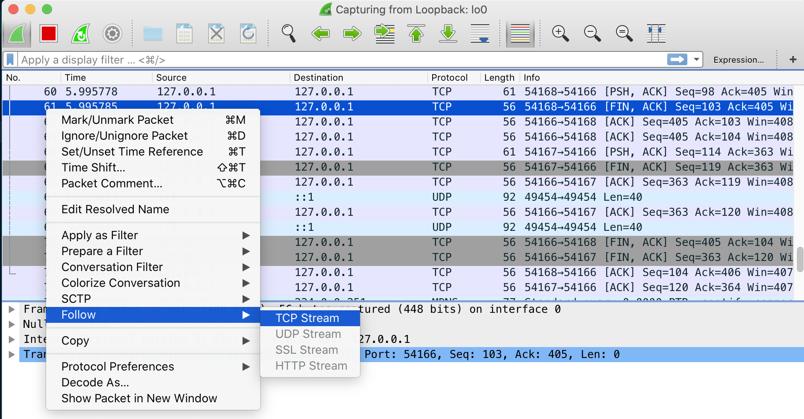
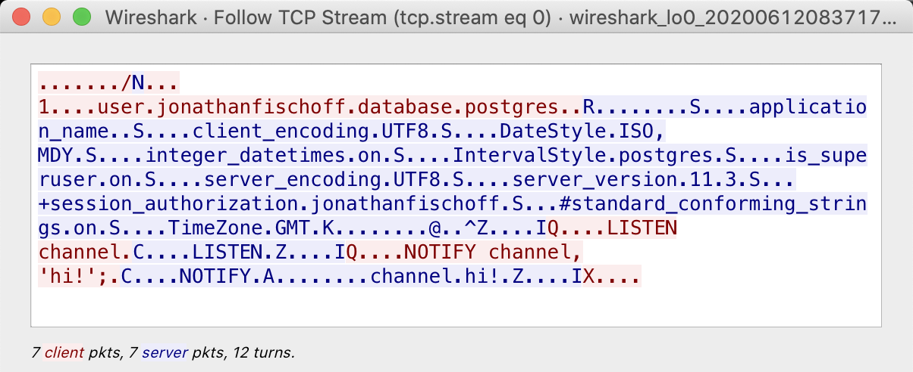
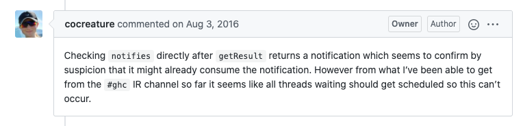

# When `threadWaitRead` Doesn't

One might think [`threadWaitRead`](http://hackage.haskell.org/package/base-4.14.0.0/docs/Control-Concurrent.html#v:threadWaitRead) (and related functions) will block until a socket recieves new data for reading.

Almost but not quite.

Consider the following [example server](https://github.com/jfischoff/threadwaitread-race):

```haskell
server :: MVar () -> Socket -> IO ()
server ready sock = flip onException (tryPutMVar ready ()) $ do
  (aSock, _) <- accept sock
  withFdSocket aSock $ \fd -> do
    -- Register a socket read ready callback
    waiter <- fmap fst $ threadWaitReadSTM (fromIntegral fd)
    waitThread <- async $ do
      atomically waiter
      putStrLn "threadWaitRead return!"
    putMVar ready ()
    threadDelay 1 -- YMMV
    print =<< recv aSock 3
    timeout 1000000 (wait waitThread) >>= \case
      Just _ -> pure ()
      Nothing -> die "timed out"
```

It is a silly server meant to show off the subtle semantics of [`threadWaitReadSTM`](http://hackage.haskell.org/package/base-4.14.0.0/docs/Control-Concurrent.html#v:threadWaitReadSTM).

After registering for the notification, `server` waits for the client to send packets by calling [`recv`](https://hackage.haskell.org/package/network-3.1.1.1/docs/Network-Socket-ByteString.html#v:recv).

Another thread blocks on `waiter` which will return when there is data to read.

If we run the test executable repeatedly we will get output like:

```
starting
"recv return"
threadWaitRead return!
starting
"recv return"
threadWaitRead return!
starting
threadWaitRead return!
"recv return"
starting
"recv return"
threadWaitRead return!
starting
threadWaitRead return!
"recv return"
starting
threadWaitRead return!
"recv return"
starting
"recv return"
timed out
```

Sometimes the `STM ()` action from `threadWaitReadSTM` never returns even though the socket recieved new data to read.

Unfortunately this is not a bug. `threadWaitReadSTM` inherits the semantics of the IO multiplexing APIs ([`kqueue`](https://developer.apple.com/library/archive/documentation/System/Conceptual/ManPages_iPhoneOS/man2/kqueue.2.html) and [`epoll`](https://man7.org/linux/man-pages/man7/epoll.7.html)) that are used to implement the [`EventManager`](https://hackage.haskell.org/package/base-4.12.0.0/docs/GHC-Event.html) backends ([1](https://github.com/ghc/packages-base/blob/master/GHC/Event/KQueue.hsc)) ([2](https://github.com/ghc/packages-base/blob/master/GHC/Event/EPoll.hsc)) and this is how they are supposed to work.

This behavior occurs on both Linux and MacOS. I know why it happens on Linux and I am assuming the same explaination holds for MacOS.

# The Subtle Semantics of `epoll_wait`

On Linux `threadWaitReadSTM` is implemented by utilizing [`epoll_wait`](https://www.man7.org/linux/man-pages/man2/epoll_wait.2.html) to recieve events registered with [`epoll_ctl`](https://man7.org/linux/man-pages/man2/epoll_ctl.2.html).

The Linux documentation has the following to say about `epoll_wait`:

```
 A call to epoll_wait() will block until either:

 · a file descriptor delivers an event;

 · the call is interrupted by a signal handler; or

 · the timeout expires.
```

This line is:
> a file descriptor delivers an event

glosses over some important details.

Event notification is a two step process. In the case of sockets, when new data is available the function [`socket_def_readable`](https://github.com/torvalds/linux/blob/cb8e59cc87201af93dfbb6c3dccc8fcad72a09c2/net/core/sock.c#L2900) is called. This causes the thread [`ep_poll`](https://github.com/torvalds/linux/blob/decd6167bf4f6bec1284006d0522381b44660df3/fs/eventpoll.c#L1820) was running on to wake up and [poll the socket](https://github.com/torvalds/linux/blob/decd6167bf4f6bec1284006d0522381b44660df3/fs/eventpoll.c#L887) to see what sort of events have occured. It does this by calling [`tcp_poll`](https://github.com/torvalds/linux/blob/a5ad5742f671de906adbf29fbedf0a04705cebad/net/ipv4/tcp.c#L499).

`tcp_poll` checks various properities of the socket to determine if there are any ready events. [`tcp_stream_is_readable`](https://github.com/torvalds/linux/blob/a5ad5742f671de906adbf29fbedf0a04705cebad/net/ipv4/tcp.c#L476) examines the socket's recieve buffer to see if there is data for reading.

A consquence of this two step wake up and check process; if between the time of waking and checking the data is read from the socket by another thread, `ep_poll` will determine there are no events to return and go back to sleep. Thus `epoll_wait` might not return even if the socket recieves new data.

This is exactly what occurs in the example server above. Sometimes `recv` happens after data is on the socket but before `tcp_poll` is executed via the `epoll_wait` path. When this occures the `threadWaitReadSTM` action (`waiter`) never returns.

## How I figured this out

I discovered this tidbit of Linux trivia while trying to understanding this bug with [`hasql-notifications`](https://github.com/cocreature/hasql-notifications) while adding notification support to [`hasql-queue`](https://github.com/jfischoff/hasql-queue), my PostgreSQL queue library.


It's a three year old bug that still wasn't fixed. The expert of `postgresql-libpq` `lpsmith` had weighed in on the bug. `cocreature` and `lpsmith` had discovered a workaround. The workaround would require inserting `threadWaitRead` between sending a query and checking for the result in the bowels of `hasql`. However they were unsure of why this was necessary.

As is on brand for me, I started by seeing if the server was sending the notification using [Wireshark](https://www.wireshark.org/).

I fired up Wireshark and used "Follow TCP Stream".



I captured the flows when the test passed and when it failed. Sadly they were identical.



Also I could see a `channel.hi!` sent from the server to the client.

I concluded from this that the notification was always sent by the server but was it received?

To see if the client was recieving the notification I could use something like `strace` but there would be a lot of noise and I don't believe `strace` can show the actual data returned by [`recvfrom`](https://linux.die.net/man/2/recvfrom).

So I opted for [`bpftrace`](https://github.com/iovisor/bpftrace) instead.

`bpftrace` is part of a suite of new Linux observability tools built off the [`ebpf`](https://lwn.net/Articles/740157/) virtual machine and Linux probe technologies.

I wrote the [following `bpftrace` script](./hardest-wont-fix/epoll_wait_debugger.bt):

```c
tracepoint:syscalls:sys_enter_recvfrom
{
    printf("%s sys_enter_recvfrom tid: %d fd=%d\n", comm, tid, args->fd);
    @sys_enter_recvfrom[tid] = args->ubuf
}

tracepoint:syscalls:sys_exit_recvfrom
{
  printf("%s sys_enter_recvfrom tid: %d message=%r return value: %d\n",
    comm, tid, buf(@sys_enter_recvfrom[tid], args->ret), args->ret);
}
```

`recvfrom` is passed an output buffer. The return value of `recvfrom` tells you how many bytes were filled in.

To gain access to the output buffer in the exit probe, I store the pointer in a thread id indexed global `@sys_enter_recvfrom` hash table in the enter probe.

In the exit probe I look up the value of `@sys_enter_recvfrom[tid]` where `tid` is the thread id. I then copy out `args->ret` using the `buf()` builtin and print it.

> Currently the `buf()` requires the latest version of `bpftrace` on GitHub which is not yet release but building it from source is easy.

Another thing to point out is `tracepoint`s arguments require specific names. I had to lookup the format of `sys_enter_recvfrom` by reading the "format" file in the appropiate `/sys/kernel/debug/tracing/events/` folder.

```
$ cat /sys/kernel/debug/tracing/events/syscalls/sys_enter_recvfrom/format
name: sys_enter_recvfrom
ID: 1357
format:
	field:unsigned short common_type;	offset:0;	size:2;	signed:0;
	field:unsigned char common_flags;	offset:2;	size:1;	signed:0;
	field:unsigned char common_preempt_count;	offset:3;	size:1;	signed:0;
	field:int common_pid;	offset:4;	size:4;	signed:1;

	field:int __syscall_nr;	offset:8;	size:4;	signed:1;
	field:int fd;	offset:16;	size:8;	signed:0;
	field:void * ubuf;	offset:24;	size:8;	signed:0;
	field:size_t size;	offset:32;	size:8;	signed:0;
	field:unsigned int flags;	offset:40;	size:8;	signed:0;
	field:struct sockaddr * addr;	offset:48;	size:8;	signed:0;
	field:int * addr_len;	offset:56;	size:8;	signed:0;
```
This how I knew to use `args->ubuf` for the output buffer.

Running the test and the `sudo bpftrace epoll_wait_debugger.bt` I get the following output:

```
...
tester:w tracepoint:syscalls:sys_enter_recvfrom tid: 3692 fd=13
tester:w tracepoint:syscalls:sys_exit_recvfrom tid: 3692 message= C\x00\x00\x00\x0bNOTIFY\x00A\x00\x00\x00\x14\x00\x00\x0e~channel\x00hi!\x00Z\x00\x00\x00\x05I return value 39
...
```

Which is the same message as seen in Wireshark.

It is interesting to reread the bug's thread with the power of hindsight. `cocreature` grasped a key element of the race condition early on:



If I had payed closer attention, I would have realized that `libpq` was recieving and parsing the notification.

Anyway, if I was recieving the notification why didn't `epoll_wait` get notified?

I researched the mechanism sockets use for alerting `epoll_wait` of new data and determined I should trace the `socket_def_readable` call.

Here is the `bpftrace` script snippet to trace `socket_def_readable` entry:

```c
#include <net/inet_sock.h>
#include <net/sock.h>

kprobe:sock_def_readable
{
  $inet_sock = (struct inet_sock *)arg0;
  $dport = (($inet_sock->inet_dport & 0xFF) << 8) | ($inet_sock->inet_dport >> 8);
  printf("%s sock_def_readable enter tid: %d port=%d\n", comm, tid, $dport);
}

kretprobe:sock_def_readable
{
   printf("%s sock_def_readable exit tid %d\n", comm, tid);
}
```

There isn't a `tracepoint` for `sock_def_readable` but since it is a kernel function, and we can trace trace it with a [`kprobe`](https://lwn.net/Articles/132196/). Unlike `tracepoint`s there isn't a format file for `kprobe`s. The arguments are all positional, hence the `arg0` for the first argument. To learn the arguments one must look at the Linux source.

One advantage of `kprobe`s I've found is some complex function arguments of `tracepoint`s cannot be inspected (I don't know if this is a bug in `bpftrace` or what) but I can inspect the arguments of the `kprobe` counterparts.

The first argument to `socket_def_readable` is a [`sock*`](https://github.com/torvalds/linux/blob/master/include/net/sock.h#L346) but we can also cast it a [`inet_sock*`](https://github.com/torvalds/linux/blob/master/include/net/inet_sock.h#L195) (for some reason I find this works better to get the destination port. Also you can get the source port this way).

By using `#include` to bring into scope definition of structs one can cast arguments in `kprobe`s and then inspect the fields of the structs.

I had to convert the port from big to little endian. That is what the bit shifting is about. At the time of writing this blog post these `bpftrace` operators are still undocumented.

Running  `sudo bpftrace epoll_wait_debugger.bt` gave:

```
tester:w sock_def_readable enter tid: 4505 port=2222
tester:w sock_def_readable exit tid: 4505
```

Okay so the socket fired it's notification to wake up `epoll_wait` but did it work? Did `epoll_wait` actually return but somehow the GHC runtime did not properly handle the event?

I extended the script with probes for `epoll_wait`.

```c
tracepoint:syscalls:sys_enter_epoll_wait
/comm == "tester:w"/
{
  printf("%s sys_enter_epoll_wait tid %d fd=%d \n", comm, tid, args->epfd);
}

tracepoint:syscalls:sys_exit_epoll_wait
/comm == "tester:w"/
{
  printf("%s sys_exit_epoll_wait tid %d\n", comm, tid);
}
```

The `EventManager` runs a on a [bound thread](https://github.com/ghc/ghc/blob/6c59cc71dc20f26d5a6650b16a82faeae72f2065/libraries/base/GHC/Event/Thread.hs#L268) with a [specific name](https://github.com/ghc/ghc/blob/64ef4d7fb131f04769c6cab331af335bd87103ec/rts/Task.c#L482) so I filtered `epoll_wait` calls using the name of the `EventManager` thread.

I run everything again and get:

```
tester:w sys_enter_epoll_wait tid: 4760 fd=3
tester:w sys_exit_epoll_wait tid: 4760
tester:w sys_enter_epoll_wait tid: 4760 fd=3
tester:w sys_exit_epoll_wait tid: 4760
tester:w sys_enter_epoll_wait tid: 4760 fd=3
```

The triple calls to `epoll_wait` are a [small optimization (hopefully)](https://github.com/ghc/ghc/blob/01b15b835a7555c501df862b4dc8cc8eaff86afc/libraries/base/GHC/Event/Manager.hs#L281) of the `EventManager` implementation to conserve OS threads. It's not important. The important piece is that we call `epoll_wait` but it never returns.

Okay so time to verify some assumptions. Was the file descriptor ready event actually registered? The registeration requires a call to `epoll_ctl`. It was time for more probes:

```c
tracepoint:syscalls:sys_enter_epoll_ctl
/comm == "tester:w"/
{
  $event = (struct epoll_event*)args->event;
  printf("sys_enter_epoll_ctl tid: %d op=%d, fd=%d event_fd=%d\n", tid, args->op, args->fd, $event->data);
}

tracepoint:syscalls:sys_exit_epoll_ctl
/comm == "tester:w"/
{
  printf("sys_exit_epoll_ctl tid: %d return value: %d\n", tid, args->ret);
}

```

Which gave:

```
sys_enter_epoll_ctl tid: 5111 op=3, fd=13 event_fd=13
sys_exit_epoll_ctl tid: 5111 return value: -2
sys_enter_epoll_ctl tid: 5111 op=1, fd=13 event_fd=13
sys_exit_epoll_ctl tid: 5111 return value: 0
```

This is the [expected sequence](https://github.com/ghc/ghc/blob/1c2c2d3dfd4c36884b22163872feb87122b4528d/libraries/base/GHC/Event/EPoll.hsc#L93). `epoll_ctl` successfully added a callback after failing to modify a non-existent callback.

There goes that theory.

Somewhat lost I started to read the `epoll_wait` source. To help understand which code paths were executed I added more `kprobe`s to see what `epoll_wait` was doing.

This when I noticed the following sequence:

```
tester:w sock_def_readable enter tid: 5902 port=2222
tester:w sock_def_readable exit tid: 5902
tester:w sys_enter_recvfrom tid: 5902 fd=13
tester:w sys_exit_recvfrom tid: 5902 message=C\x00\x00\x00\x0bNOTIFY\x00A\x00\x00\x00\x14\x00\x00\x17 channel\x00hi!\x00Z\x00\x00\x00\x05I return value: 39
tester:w kprobe:ep_send_events_proc tid: 5900
tester:w kprobe:ep_item_poll.isra.0 tid: 5900
tester:w kretprobe:ep_item_poll.isra.0 tid: 5900
tester:w kretprobe:ep_send_events_proc tid: 5900
```

> Notice the funny name for the kprobe `ep_item_poll.isra.0`? I don't know what this is about but a technique I use to discover the real name of kernel functions that at first fail is to use a wildcard. So I used the probe name `ep_item_pol*`. Now that I know the name I can just use `ep_item_poll.isra.0`

When the test would pass the sequeuence was similar but would end with `epoll_wait` returning.

[Looking at the code](https://github.com/torvalds/linux/blob/65759097d804d2a9ad2b687db436319704ba7019/fs/eventpoll.c#L1944) it seemed like the `epoll_wait` thread would wake up and check to see what the events were available and then go back to sleep if it could not find one.

What can clear out events? Closing a file descriptor could I assumed.

I traced out [`close`](https://linux.die.net/man/2/close). Nothing out of the ordinary.

Then I noticed the difference between success and failure was when the `recvfrom` occured. If the sequeunce went

1. sock_def_readable
1. ep_send_events_proc
1. sys_enter_recvfrom

Everything worked. `epoll_wait` returned.

If the sequence went:

1. sock_def_readable
1. sys_enter_recvfrom
1. ep_send_events_proc

`epoll_wait` would not return. Somehow `recvfrom` was clearing out the read ready event.

By reading through the code for [`recvfrom`](https://github.com/torvalds/linux/blob/cb8e59cc87201af93dfbb6c3dccc8fcad72a09c2/net/socket.c#L2025) I could not see how it was doing this. Then I happened to reread [this blog post](https://idndx.com/2014/09/03/the-implementation-of-epoll-2/) and it talked about a similar situation with write ready events. It mentioned the role `tcp_poll` played.

`tcp_poll` was the missing piece of the puzzle. I added the probe and saw that when [`ep_item_poll`](https://github.com/torvalds/linux/blob/65759097d804d2a9ad2b687db436319704ba7019/fs/eventpoll.c#L879) called `tcp_poll` before `recvfrom` ran `tcp_poll` returned `325` which is equivalent the event flags:

```c
EPOLLIN /*0x1*/ | EPOLLRDNORM /*0x40*/ | EPOLLOUT /*0x4*/| EPOLLWRNORM /*0x100*/
```

However if `recvfrom` ran first, `tcp_poll` would return `260` cooresponding ot the event flags:

```c
EPOLLOUT | EPOLLWRNORM
```

At which point `epoll_wait` would not return because the socket was not ready for reading. `recvfrom` had already read all the data.

# All Lies

This is cleaned up version of the steps I took. It's not really in order. In reality, I started by ignoring the problem and convincing myself it couldn't affect me. Then I tried to use DTrace and failed (DTrace never seems to work well on Macs). So I moved to Linux and recompiled GHC, adding tracing to the `EventManager` and dumped an eventlog.

I learned a lot of details on how the `EventManager` and how GHC's scheduler worked but could not find any issues.

I decided this was an opportunity to read ["BPF Performance Tools"](http://www.brendangregg.com/bpf-performance-tools-book.html) and it was helpful. I wandered through the Linux network stack using the `bpftrace`'s `kstack` call to understand the sequences of functions for sending and recieving data on localhost. I learned a lot. It was very interesting. It was an inefficent way to solve this bug.

I made a bunch of wrong turns but steps above are what ulimately helped after I tried many things that didn't. I got lucky finding `tcp_poll`. In the retrospect debugging with kernel symbols might have been a better approach. Something to try next time.

# Final Words on PostgreSQL Notifications.

Back to the bug that started this all.

Now that I understand the mechanics of the issue can the bug be fixed?

I see two ways to avoid the bug `hasql-notification` has.

One is two use a simpler implementation which assumes the connection used for waiting will not be used for anything else. This is the approach I took with [`libpq-postgresql-notify`](https://hackage.haskell.org/package/postgresql-libpq-notify).

`lpsmith`'s original notification design is very clever. It is written in a way where it, in theory, can wait for a notification while freeing the connection up for other operations.

However due to the semantics of `threadWaitRead` we have to be very careful no calls to `recvfrom` are made without `epoll_wait` returning first. It might be possible to do this using the a similar approach to one `cocreature` developed.

I think one would need to call `threadWaitReadSTM` *before* a call to `sendQuery` and then *wait* on it after the `sendQuery` call and before a call to `getResult`. I'm not positive this eliminates all races between the query thread and the notification thread. Otherwise one might block before `getResult` forever. Also care will have to be taken to do the same with `consumeInput` or anythiing else that can call `recvfrom` on the connection anywhere inside the `libpq` codebase.

The advantage of this solution is it is able to use connection resources more efficently. This solution seems possible but easy to mess up.

Something to think about more in the future, back to releasing `hasql-queue`.
